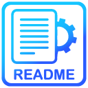

 

 

  

<h3 align="center">PROJECT HYDRA</h3>

  

    Essa página é uma landing/single page criada para mostrar um pouco dos meus conhecimentos e habilidades
  

  
  <a href="https://edilan-ribeiro.github.io/hydra-project">Clique aqui para abrir o projeto online</a>

 

  
Índice

  <ol>
    <li>
      <a href="#sobre-o-projeto">Sobre o projeto</a>
      <ul>
        <li><a href="#feito-com">Feito com</a></li>
        <li><a href="#notas-de-destaque">Notas de destaque</a></li>
        <li><a href="#desafios-e-aprendizados">Desafios e aprendizados</a></li>
        </ul>
    </li>
    <li><a href="#contato">Contato</a></li>
  </ol>

  

## Sobre o projeto

 

Uma landing page ou single page é uma ferramenta estratégica que descreve de forma sucinta e focada um produto, serviço ou oferta.
Ela tem um papel fundamental na conversão de visitantes em clientes ou em ações específicas, como preenchimento de formulários, inscrições ou compras.
O objetivo dessa página busca atrair o cliente a preencher o formulário

 
<strong>Como ficou no mobile</strong>:

 

(<a href="#readme-top">back to top</a>)

### Feito com

(<a href="#readme-top">back to top</a>)

 

## Notas de destaque

 

Esta página foi baseada no layout do FIGMA criado por ZINE. E. FALOUTI 
<a href="https://www.figma.com/file/nauHlmXLdOnXq12HoROex1/Hydra-Landing-Page-(Community)?type=design&node-id=0-1&mode=design&t=Wb8M0y8o3z57TLEF-0" target="_blank"> você pode conferir o design dele aqui </a>

 

Os destaques desta página incluem:

- Layout responsivo
- Rolagem suave
- Formulário frontend funcional (apenas não salva os dados)
- Sliders
- Botões animados

(<a href="#readme-top">back to top</a>)

### Desafios e aprendizados

✨ Infelizmente o design não contém imagens de fundo apenas vetores meio soltos o que impede o pixel perfect, todavia graças a isso, aumentei bastante meus conhecimentos em CSS na manipulação de posicionamento de containers e elementos.

📱 Já no responsivo o maior desafio foi a manipulação de sliders, houve a necessidade criar em javascript base para adaptar toda a movimentação ocorrendo por trás das cortinas, apenas mover os elementos não é viável.

⏲️ Apesar do tempo de criação ter sido um pouco maior do que o esperado por mim, foi possível executar com sucesso a separação de componentes e responsabilidades de forma que qualquer manutenção ou atualização necessária no código será mais simples no futuro.

Em suma consegui melhorar:
 - Habilidades de manipulação do DOM
 - Posicionamento e camadas da página no CSS
 - Aprimoramento na aplicação de técnicas de clean code e HTML semântico

## Contato

💌 Para me mandar uma mensagem basta usar um dos botões abaixo! 

  
   
  

(<a href="#readme-top">back to top</a>)
